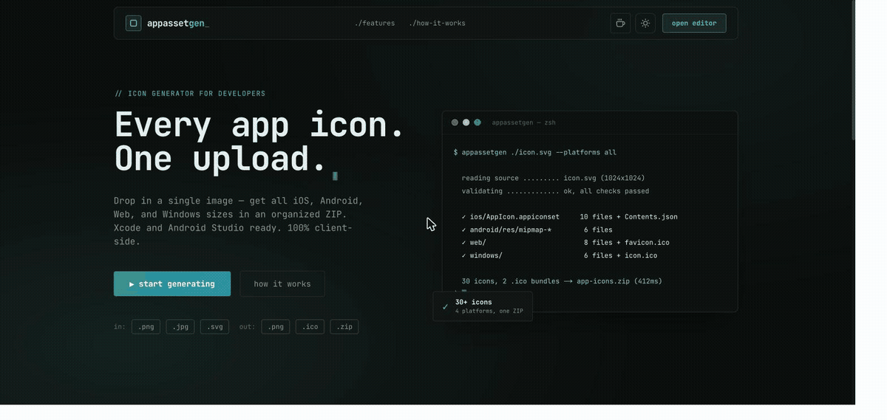

# AppAssetGen

**Every app icon. One upload.**

Drop in a single image and get all iOS, Android, Web/PWA, and Windows icon sizes in an organized ZIP — Xcode and Android Studio ready. Runs 100% in your browser: no backend, no accounts, your artwork never leaves your machine.



## Features

- **30+ icons, 4 platforms** — iOS `AppIcon.appiconset` (with `Contents.json`), Android `mipmap-*` folders + Play Store icon, web favicons + PWA manifest icons, Windows sizes
- **Real `.ico` output** — multi-size `favicon.ico` and Windows `icon.ico` built in-browser
- **Live editing** — padding, background (auto edge-color, blur, transparent, custom), rounded corners, rotation, brightness/contrast, fit/fill
- **Validation built in** — warns on low resolution, non-square sources, safe-zone overflow, and weak contrast
- **Device previews** — iOS home screen, Android launcher, and browser-tab mockups in light/dark
- **SVG input** — cleanup + sharp rasterization, aspect ratio preserved
- **Extras** — custom sizes, single-size download, copy-paste favicon HTML tags, dark mode

## Quick start

```bash
git clone https://github.com/zoddiacc/appassetgen.git
cd appassetgen
npm install
npm run dev     # http://localhost:3000
```

Production build: `npm run build && npm start`. Deploys anywhere that serves a Next.js app (Vercel works out of the box, no env vars needed).

## How it works

Everything is client-side. Images are processed with the HTML Canvas API, zipped with JSZip, and downloaded with file-saver. There are no API routes, no database, and no telemetry.

```
lib/
├── render-icon.ts     # single rendering pipeline (every preview + export goes through here)
├── icon-generator.ts  # renders each size to a PNG blob (iOS forced opaque)
├── ico-builder.ts     # builds .ico files (PNG-embedded)
├── zip-builder.ts     # ZIP layout, Contents.json, webmanifest, README
├── svg-utils.ts       # SVG cleanup + rasterization
├── validation.ts      # resolution / aspect / contrast / safe-zone checks
├── color-utils.ts     # edge-color sampling, blurred backgrounds
└── constants.ts       # every icon size spec
```

Platform notes: iOS icons are always exported fully opaque (Apple rejects alpha); every other platform honors transparency and rounded corners.

## ZIP output

```
app-icons-<timestamp>.zip
├── ios/AppIcon.appiconset/     # 10 PNGs + Contents.json (drag into Xcode)
├── android/res/mipmap-*/       # 5 densities + playstore/icon-512.png
├── web/                        # favicons, apple-touch-icon, PWA icons,
│                               # favicon.ico, site.webmanifest, favicon.html
├── windows/                    # 6 PNGs + icon.ico
└── README.txt                  # per-platform install instructions
```

## Tech stack

Next.js 14 (App Router, TypeScript) · Tailwind CSS · HTML Canvas API · JSZip · file-saver · Sonner · JetBrains Mono

## Contributing

Issues and PRs welcome — see [CONTRIBUTING.md](CONTRIBUTING.md). All changes go through pull requests; the `main` branch is protected.

## License

[MIT](LICENSE) © VaanLabs
